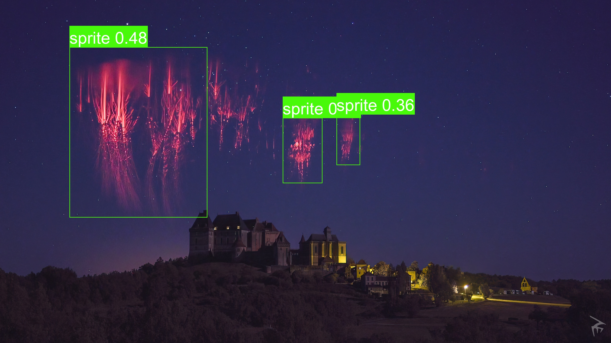

# What is this?

This is a pretrained PyTorch-Model that allows identifying most of the stuff that flies around in the skies that are often misinterpreted as UFOs.

Input: an Image (or video, depending on your implementation).

Output: List of Bounding Boxes, that is, a list of coordinates, categories it detects something as and how certain the network is that this category.



# How to prepare your environment

This guide is for Debian-Linux only. 

## Preparation

The following snippet will prepare your environment (install, Python, PyTorch, ...), so you can simply use this model:

```console
sudo apt-get install python3 python3-pip 
python3 -m pip install --upgrade pip
pip3 install virtualenv
python3 -m venv ~/.yolo_env
source ~/.yolo_env/bin/activate
git clone --depth 1 https://github.com/ultralytics/yolov5.git
cd yolov5
pip3 install -r requirements.txt
```

Now you can use `source ~/.yolo_env/bin/activate` to load this environment before loading the main script with `python3 example.py`.
